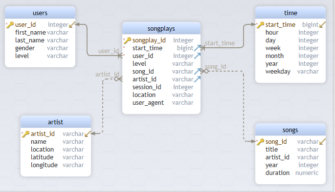

# Project: Data Modeling with Postgres

## Introduction

A startup called Sparkify wants to analyze the data they've been collecting on songs and user activity on their new music streaming app. The analytics team is particularly interested in understanding what songs users are listening to. Currently, they don't have an easy way to query their data, which resides in a directory of JSON logs on user activity on the app, as well as a directory with JSON metadata on the songs in their app.

They'd like a data engineer to create a Postgres database with tables designed to optimize queries on song play analysis, and bring you on the project. Your role is to create a database schema and ETL pipeline for this analysis. You'll be able to test your database and ETL pipeline by running queries given to you by the analytics team from Sparkify and compare your results with their expected results.

## Project Description

In this project, you'll apply what you've learned on data modeling with Postgres and build an ETL pipeline using Python. To complete the project, you will need to define fact and dimension tables for a star schema for a particular analytic focus, and write an ETL pipeline that transfers data from files in two local directories into these tables in Postgres using Python and SQL.

## Data modeling and schema:

This pipeline builds data models with star schema. 5 tables will be created in database:

    One Fact Table : songplays
    Four Dimension Tables:  users, songs, artist, time
        
### Fact Table

**Table songplays**

| COLUMN        | TYPE     | CONSTRAINT  |
|---   |---     |---       | 
|  songplay_id  | serial   | PRIMARY KEY | 
|  start_time   | bigint   | FOREIGN KEY | 
|  user_id      | int      | FOREIGN KEY | 
|  level        | varchar  |             | 
|  song_id      | varchar  | FOREIGN KEY | 
|  artist_id    | varchar  | FOREIGN KEY | 
|  session_id   | int      |             | 
|  location     | text     |             | 
|  user_agent   | text     |             | 

The songplay_id field is the primary key and it is serial, which means it is an auto-generated unique integer numbers  and auto-increment.

I added foreign keys for the fields start_time (links to time table), user_id (links to users table), 
artist_id (links to artist table) and song_id (links to songs table). Foreign keys help to enforce referential integrity at the data level. However, some suggested foreign keys are not necessary in some senarios:
https://dataedo.com/blog/why-there-are-no-foreign-keys-in-your-database-referential-integrity-checks .

The query to insert data on this table is:

``INSERT INTO songplays
(start_time, user_id,level,song_id,artist_id,session_id,location,user_agent) 
VALUES(%s,%s,%s,%s,%s,%s,%s,%s)``

### Dimensions Tables

 
 **Table users**
 
| COLUMN       | TYPE       | CONSTRAINT    |
|---           |---  |---   | 
|   user_id    | int        |   PRIMARY KEY | 
|   first_name | varchar    |               | 
|   last_name  | varchar    |               | 
|   gender     | varchar    |               | 
|   level      | varchar    |               | 

 
 The query to insert data on this table is:
 
``INSERT INTO users 
(user_id, first_name,last_name,gender,level) 
VALUES(%s,%s,%s,%s,%s) ON CONFLICT(user_id)
DO UPDATE SET level=EXCLUDED.level``

 **Table song**
 
| COLUMN       | TYPE       | CONSTRAINT    |
|---           |---  |---   | 
|   song_id    | varchar    |   PRIMARY KEY | 
|   title      | varchar    |               | 
|   artist_id  | varchar    |               | 
|   year       | int        |               | 
|   duration   | numeric    |               | 

 
 The query to insert data on this table is:
 
``INSERT INTO songs 
(song_id,title,artist_id,year,duration) 
VALUES (%s, %s, %s,%s,%s) 
ON CONFLICT (song_id ) 
DO NOTHING``
    
**Table artists**

| COLUMN      | TYPE         | CONSTRAINT    |
|---          |---           |---            | 
|   artist_id | varchar      |   PRIMARY KEY | 
|   name      |   varchar    |               | 
|   location  |   varchar    |               | 
|   latitude  |   varchar    |               | 
|   longitude |   varchar    |               | 

 The query to insert data on this table is:
 
``INSERT INTO artist (artist_id, name,location,latitude,longitude)
VALUES (%s,%s,%s,%s,%s)
ON CONFLICT (artist_id ) 
DO NOTHING``

**Table time**
 
| COLUMN       | TYPE     | CONSTRAINT    |
|---           |---       |---            | 
|   start_time | bigint   |   PRIMARY KEY | 
|   hour       |   int    |               | 
|   day        |   int    |               | 
|   week       |   int    |               | 
|   month      |   int    |               | 
|   year       |   int    |               | 
|   weekday    |   varchar|               | 

 The query to insert data on this table is:
 
``INSERT INTO time
(start_time,hour, day, week, month,year,weekday) 
VALUES (%s,%s,%s,%s,%s,%s,%s) 
ON CONFLICT(start_time)
DO NOTHING``

### Database is  organized with star schema:

## Files inuded in the ETL pipeline:

<b>1. data:</b> a folder including song and user activity data.

<b>2. look_log.ipynb:</b> gives you a peek on the structure of the log data.

<b>3. sql_queries.py:</b> defines sql queries to create table, insert records to table, join tables, and drop table.

<b>4. create_tables.py :</b> creates tables with column names.

<b>5. etl.ipynb : </b> reads data from files and inserts data in to tables. (This is a prototype for development, it only process partial data. To generate a full dataset, use etl.py)

<b>6. etl.py :</b> reads data from files and inserts data into tables. The companents and data processing procedures are:
    
<b>main()</b>

   Connects postgreSQL database, and calls the process_data() function. Parameters are passed to the process_data() function, including the database connection and cursor, the path to the data files and a data handling function (process_song_file () function or process_log_file () function). 
        
   When data processing finished, this function will close the database connection.

<b>process_data(cur, conn, filepath, func)</b>

   After being called by main function,this function checks the locations (folders) where the files locate,and generates a list containing paths to all the files. This function then iterate over the files and call the data handling functon (the parameter func) for next step process.

   To call the data handleing function, two parameter were passed: database cursor and filepath.

<b>process_song_file(cur, filepath)</b>

   After being called by the process_data function, this function loads song files into dataframe and inserts records into database:
        
     song data to songs table;
     artist data into the artist table.

<b>process_log_file(cur, filepath)</b>

   After being called by the process_data function, this function loads log files into dataframe,filters and formats the records, and inserts records into database:
        
      time data to the time table;
      user data into the users table;
      songplay  records to the song play table.

<b>7. test.ipynb:</b> checks if the ETL pipline works sucessfully.

